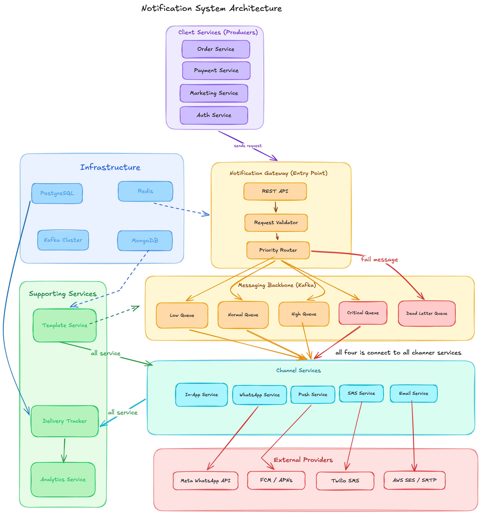
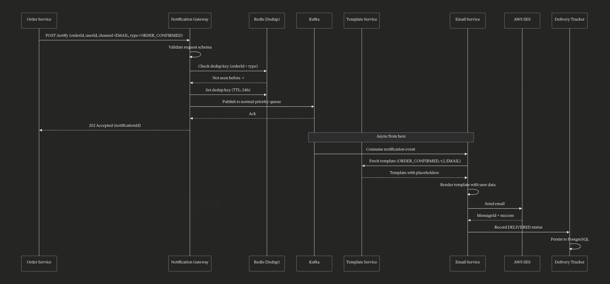
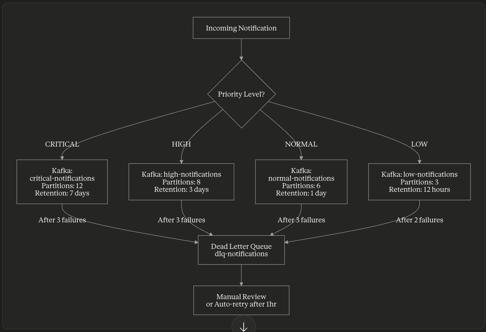

# Distributed Notification Engine

A Distributed Notification Engine is a scalable system that sends notifications to users through multiple channels like Push, SMS, Email, WhatsApp, and In-App messages. It ensures the right message reaches the right user at the right time, even when millions of notifications are processed every second. The system uses queues, priority-based routing, retries, and failover mechanisms to guarantee reliable delivery without message loss or duplication.

---

## System Architecture



```
Client Service → Notification Gateway → Validation & Deduplication → Kafka Priority Queue → Channel Services → External Providers → Delivery Tracker
```

---

## How All the Pieces Connect — The Journey of One Notification



When a user places an order, the Order Service sends a notification request to the Notification Gateway. The gateway validates the request, checks Redis to prevent duplicate notifications, and publishes the event to Kafka based on its priority. From there, channel services like Email, SMS, Push, or WhatsApp consume the event asynchronously and fetch the correct template from the Template Service.

The selected channel service then renders the message with user data and sends it through external providers such as AWS SES, Twilio, or FCM. Finally, the Delivery Tracker records the delivery status in the database for monitoring, retries, and analytics. This architecture ensures notifications are fast, scalable, fault-tolerant, and reliable even under heavy traffic.

---

## Components

**Client Services (Producers):** Order Service, Payment Service, Marketing Service, Auth Service

**Notification Gateway:** Request Validation, Deduplication, Priority Routing, Kafka Publishing

**Infrastructure:** PostgreSQL, Redis, Kafka, MongoDB

**Channel Services:** In-App Service, WhatsApp Service, Push Service, SMS Service, Email Service

**Supporting Services:** Template Service, Delivery Tracker, Analytics Service

**External Providers:** Meta WhatsApp API, FCM / APNs, Twilio SMS, AWS SES / SMTP

---

## Why Each Technology Was Chosen

We need a stack that handles high-throughput asynchronous messaging, stores both structured and unstructured data, prevents duplicate notifications, and supports priority-based message routing.

| Technology | Purpose in System | Why It Was Chosen |
|---|---|---|
| **Java 21 + Spring Boot 4** | Core backend services | Virtual Threads (Project Loom) provide high concurrency with simpler code. Spring Boot is widely used for scalable microservices. |
| **Kafka** | Distributed messaging backbone | Handles massive throughput, durable event streaming, retries, and asynchronous communication. |
| **RabbitMQ** | Priority-based routing | Supports message priority queues for urgent notifications inside channel services. |
| **Redis** | Deduplication & caching | Extremely fast in-memory operations with TTL support for duplicate prevention and rate limiting. |
| **PostgreSQL** | Delivery tracking & audit logs | Reliable relational database with ACID guarantees for tracking notification states. |
| **MongoDB** | Template storage | Flexible schema design makes it suitable for storing dynamic notification templates. |
| **Docker** | Containerization | Ensures consistent environments across development and production. |
| **AWS** | Cloud infrastructure | Provides scalable infrastructure and managed services for deployment and delivery. |

---

## Priority Queue Architecture



### Queue Configuration

| Queue | Kafka Topic | Partitions | Retention |
|---|---|---|---|
| Critical Queue | `critical-notifications` | 12 | 7 days |
| High Queue | `high-notifications` | 8 | 3 days |
| Normal Queue | `normal-notifications` | 6 | 1 day |
| Low Queue | `low-notifications` | 3 | 12 hours |

### Dead Letter Queue (DLQ)

If a notification fails multiple times, it is moved to the DLQ based on priority:

- Critical / High / Normal → move to DLQ after 3 failures
- Low Priority → move to DLQ after 2 failures

Failed messages are stored in `dlq-notifications` and can later be retried automatically, manually reviewed, or reprocessed after provider recovery.

---

## Repository Structure

```
distributed-notification-engine/
│
├── .github/
│   └── workflows/
│       └── build.yml
│
├── docs/
│   ├── architecture/
│   │   └── system-overview.md
│   └── adr/
│       └── ADR-001-stack-selection.md
│
├── docker/
│   ├── docker-compose.yml
│   └── docker-compose.override.yml
│
├── shared/
│   ├── src/
│   └── pom.xml
│
├── notification-gateway/
│   ├── src/
│   │   ├── main/
│   │   │   ├── java/
│   │   │   └── resources/
│   │   │       └── application.yml
│   │   └── test/
│   └── pom.xml
│
├── template-service/
│   ├── src/
│   └── pom.xml
│
├── email-service/
│   ├── src/
│   └── pom.xml
│
├── sms-service/
│   ├── src/
│   └── pom.xml
│
├── push-service/
│   ├── src/
│   └── pom.xml
│
├── whatsapp-service/
│   ├── src/
│   └── pom.xml
│
├── delivery-tracker/
│   ├── src/
│   └── pom.xml
│
├── analytics-service/
│   ├── src/
│   └── pom.xml
│
├── .gitignore
├── .editorconfig
└── pom.xml
```