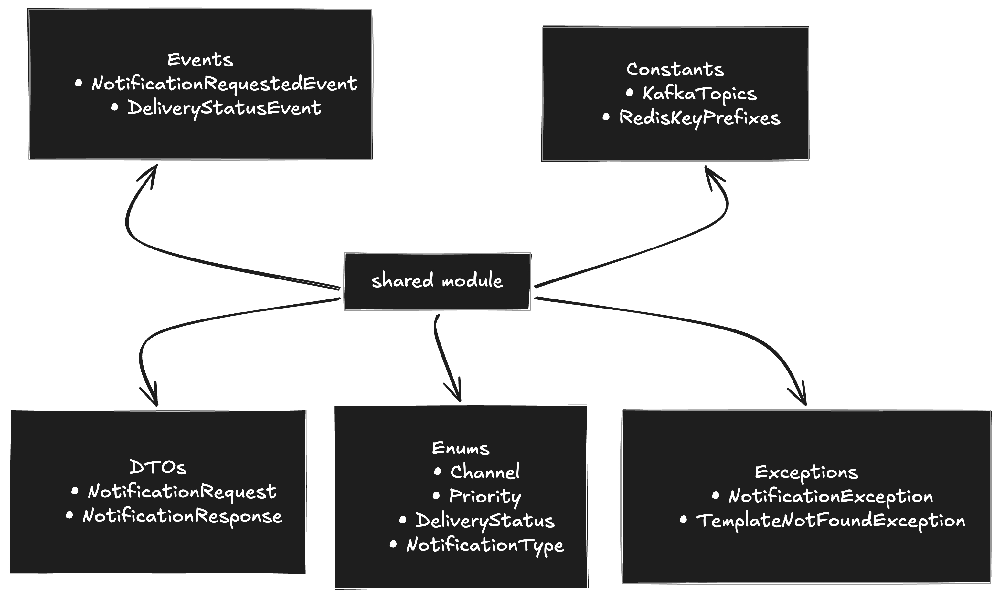

# Shared Module

The shared module is a plain Java library — no Spring Boot main class, no embedded server. It produces a `.jar` that every service adds as a dependency.

---
## Architecture Overview



---

## Package Structure

```text
shared/
└── src/
    └── main/
        └── java/
            └── com/adimehta/notificationengine/shared/
                ├── constants/
                │   ├── KafkaTopics.java
                │   └── RedisKeys.java
                ├── enums/
                │   ├── Channel.java
                │   ├── Priority.java
                │   ├── DeliveryStatus.java
                │   └── NotificationType.java
                └── events/
                    ├── NotificationRequestedEvent.java
                    └── DeliveryStatusEvent.java
```

---

## Package Description

### `constants/`
Contains application-wide constants shared across services.

- `KafkaTopics.java` → Kafka topic names
- `RedisKeys.java` → Redis key prefixes/constants

### `enums/`
Contains reusable enums used throughout the notification system.

- `Channel.java`
- `Priority.java`
- `DeliveryStatus.java`
- `NotificationType.java`

### `events/`
Contains shared event payloads used for asynchronous communication between microservices.

- `NotificationRequestedEvent.java`
- `DeliveryStatusEvent.java`